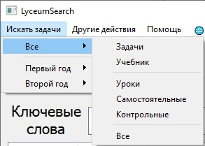
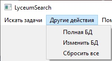
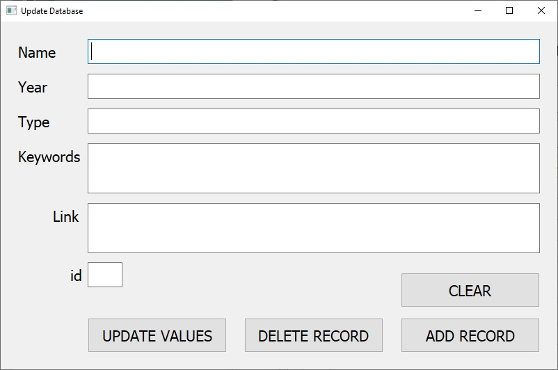
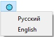

# LyceumSearch

Приложение, позволяющее искать задачи в Яндекс.Лицее (такой функции на сайте нет).

## Начало работы

### Требования

Для работы программы нужно установить пакеты из requirements.txt

Из папки с приложением это можно сделать командой:

```
pip install -r requirements.txt
```

## Работа с программой

### Интерфейс


Надпись **'Все'** означает, что при нажатии кнопки, будет идти поиск по всему (Темам, задачам, учебнику).

### Искать задачи

Чтобы это изменить, нужно выбрать секцию в разделе Искать задачи.



### Другие действия



#### Полная БД

Из дополнительных возможностей можно открыть 'Полную БД', которая содержит всю информацию о всем.

Например при обычном выводе результатов через 'Искать задачи' будет отображаться только три поля (Название, Тип, Ссылка), в то время как 'Полная БД' содержит 6 полей

#### Изменить БД

Кнопка 'Изменить БД' открывает окно для изменения базы данных. Рекомендуется сначала посмотреть на структуру БД, нажав на предыдущую кнопку.



**_О неочевидных полях:_**
1. **Year**
  - 1 
  - 2
2. **Type**
  - problem (Задача)
  - book (Учебник)
  - lesson (Урок)
  - iwork (Самостоятельная)
  - test (Контрольная)
3. **Keywords** (Ключевые слова для поиска, лучше писать то, что бы вы вводили в поиск, ища эту страницу)
4. **Link** (Ссылка на страницу. **Самое важное удалять /solutions0000000 из ссылок на задачи, на которые вы уже загружали решения, эта ссылка только для вас, у других все сломается**)

- **ADD RECORD**
Добавляет новую запись

- **DELETE RECORD**
Удаляет введеный текст из всех полей

- **UPDATE RECORD**
Удаляет введеный текст из всех полей

- **CLEAR**
Удаляет введеный текст из всех полей

#### Сбросить все

'Сбросить все' сбрасывает все настройки на те, которые записаны в defaults.txt

### Помощь

#### Открыть обучение


Единственная кнопка открывает обучение, если вы забыли, как пользоваться чем-то в программе.

**ПОКА ЧТО ОБУЧЕНИЯ НЕТ**

### Смена языка



Стандартный язык — русский, английский **_не предполагается_** для использования кем-либо не русским. Он существует лишь для "эстетики" (мало ли вам русский режет глаза).

<!-- CONTRIBUTING -->
## Contributing

```
На данный момент буду благодарен, если вы отправите базу данных с бóльшим количеством задач.
Сейчас их около 1/50 от всех, хватает только для демонстрации.
```

Contributions are what make the open source community such an amazing place to be learn, inspire, and create. Any contributions you make are **greatly appreciated**.

1. Fork the Project
2. Create your Feature Branch (`git checkout -b feature/AmazingFeature`)
3. Commit your Changes (`git commit -m 'Add some AmazingFeature'`)
4. Push to the Branch (`git push origin feature/AmazingFeature`)
5. Open a Pull Request

## Авторы

* **pworty** - *Вся работа* - [pworty](https://github.com/pworty)
* Здесь будут ребята, которые помогли мне дополнить БД

## TODO:
* Добавить обучение
* Добавить масштабирование окон
* Пофиксить то, что поиск на Enter не работает, когда вводишь поисковой запрос
