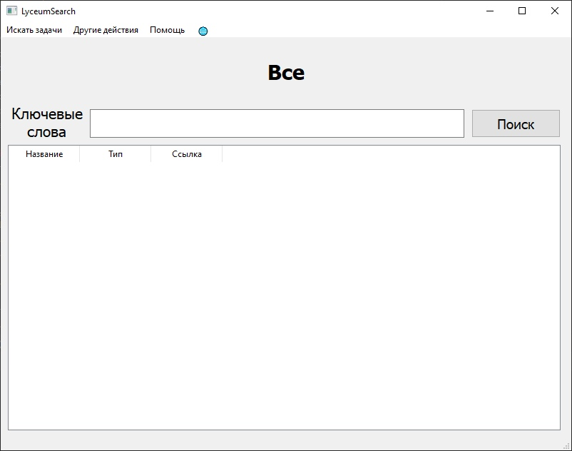

# LyceumSearch

Приложение, позволяющее искать задачи в Яндекс.Лицее, такой функции на сайте нет.

## Начало работы

### Требования

Для работы программы нужно установить пакеты из requirements.txt

Из папки с приложением это можно сделать командой

```
pip install -r requirements.txt
```

## Работа с программой

### Интерфейс



Надпись **'Все'** означает, что при нажатии кнопки, будет идти поиск по всем задачам

Чтобы это изменить, нужно выбрать секцию в разделе Искать задачи


### And coding style tests

Explain what these tests test and why

```
Give an example
```

## Авторы

* **pworty** - *Вся работа* - [pworty](https://github.com/pworty)

## TODO:

* Hat tip to anyone whose code was used
* Inspiration
* etc
